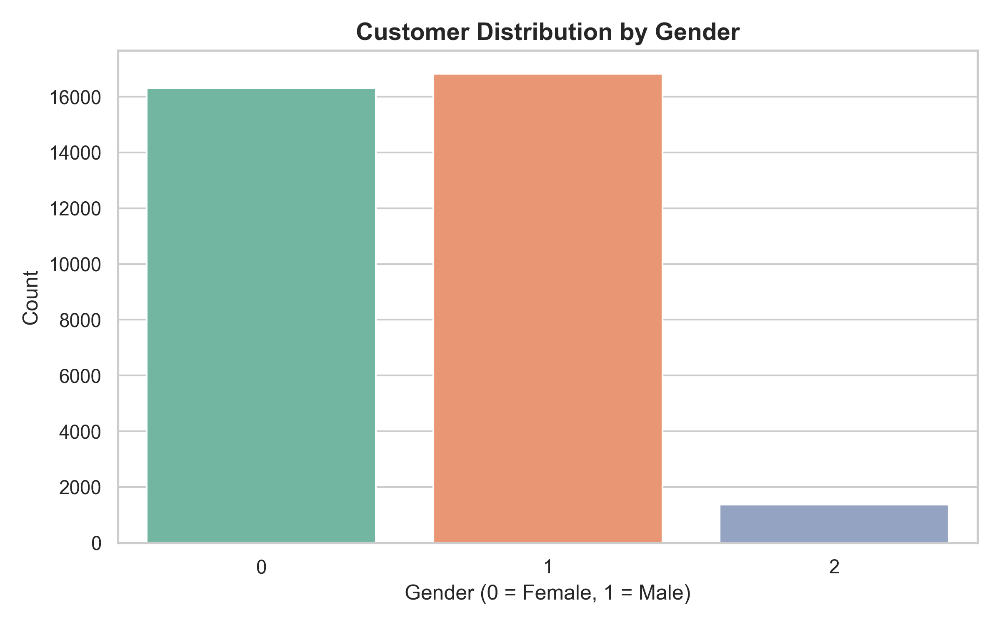
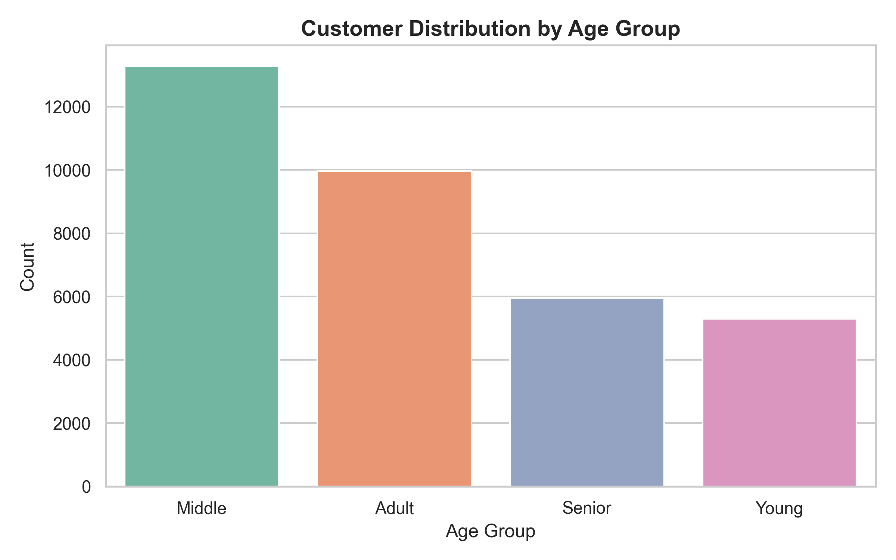
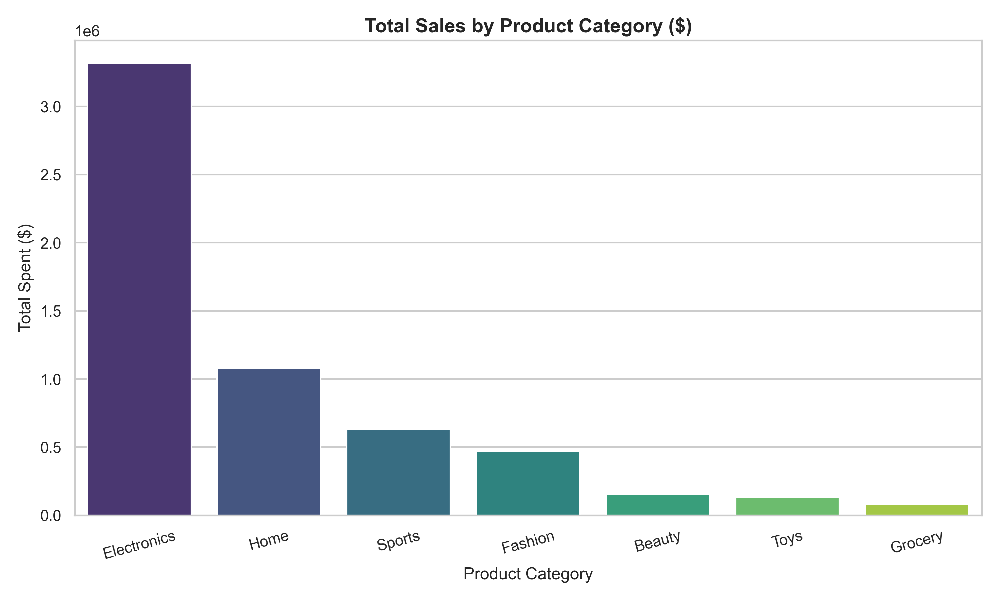
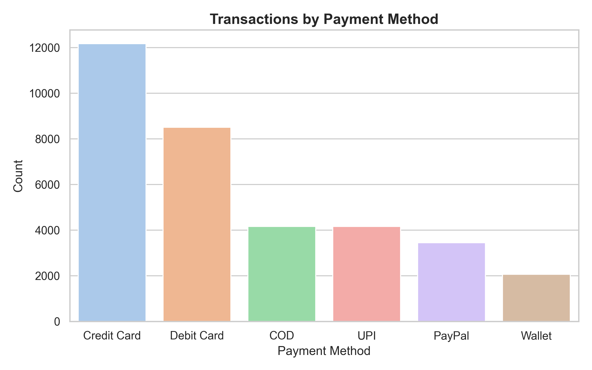
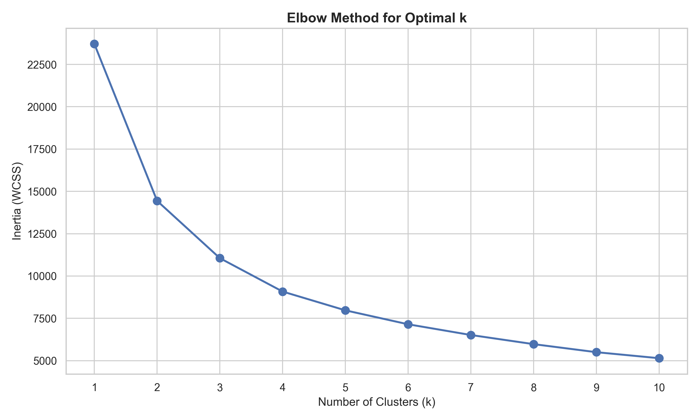
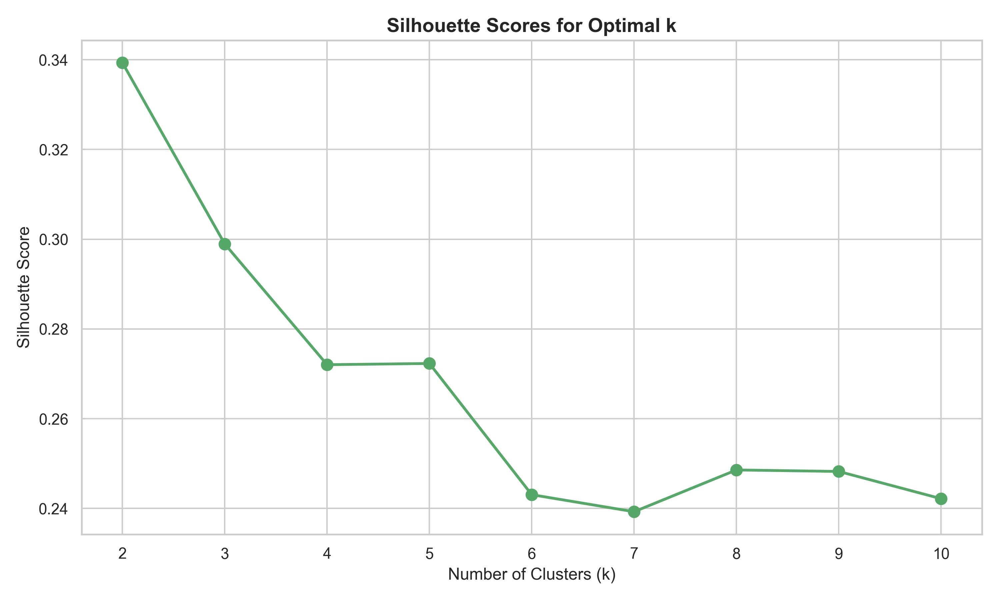
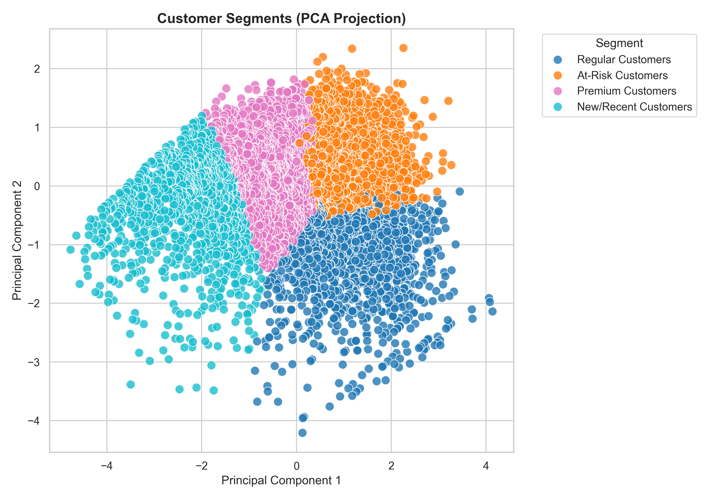
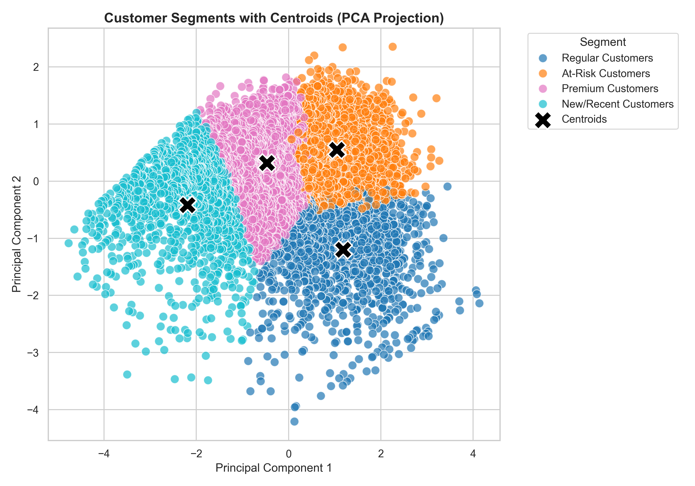

# 🛍️ E-Commerce Customer Behavior Analysis and Segmentation System

## 📌 Project Overview
In the competitive landscape of e-commerce, understanding customer purchasing behavior, spending habits, shopping trends, and product preferences is crucial for business growth and customer retention. This project provides a comprehensive data analytics and machine learning system to analyze e-commerce transaction data, perform customer segmentation, and generate actionable business insights.

The system performs:
* **Exploratory Data Analysis (EDA)** to discover key customer and sales trends.
* **RFM (Recency, Frequency, Monetary) Analysis** to score and group customers.
* **Customer Segmentation using K-Means Clustering** to identify customer personas (e.g., Premium, Loyal, New, At-Risk).
* **Business Insights Generation** to support strategic marketing and decision-making.

---

## 🎯 Objectives
* **Demographic Analysis:** Understand customer distribution across age groups and genders.
* **Spend & Purchasing Patterns:** Study customer spending behavior, transaction sizes, and purchase frequencies.
* **Product Performance:** Identify top-selling and most profitable product categories.
* **Payment & Shipping Insights:** Analyze the most popular payment methods and shipping trends.
* **Machine Learning Segmentation:** Cluster customers using RFM metrics with K-Means clustering to create distinct customer segments for targeted marketing campaigns.

---

## 📊 Dataset Used
The system uses the **[Miadul E-Commerce Sales Transactions Dataset](https://www.kaggle.com/datasets/miadul/e-commerce-sales-transactions-dataset/data)**. The dataset contains transaction records including:
* **Customer Profile:** Customer ID, Age, Gender.
* **Transaction Details:** Order ID, Product ID, Category, Price, Quantity, Discount, Payment Method, Order Date.
* **Shipping & Profit:** Delivery Time, Shipping Cost, Profit Margin, Return Status.

---

## 🛠️ Tech Stack & Libraries
* **Language:** Python
* **Data Processing & Manipulation:** Pandas, NumPy
* **Data Visualization:** Matplotlib, Seaborn
* **Machine Learning & Modeling:** Scikit-Learn
* **Development Environment:** Jupyter Notebook

---

## 🔄 Project Workflow & Analysis

### 1. Data Collection & Preprocessing
* Cleaned raw transaction logs by handling missing values, duplicates, and data type formatting.
* Performed feature engineering to extract date metrics (order month, year, day of week, weekend indicator) and age groups (Young, Adult, Middle, Senior).
* Structured the dataset into `ecommerce_cleaned.csv`.

---

### 2. Exploratory Data Analysis (EDA)

#### 👥 Customer Demographics
* Analyzed customer distribution by gender and age group.
* Gender distribution shows a balanced representation of male and female shoppers.




#### 🛍️ Spend & Product Category Analysis
* Evaluated which product categories generated the highest overall sales.
* **Electronics** and **Home** items lead in total revenue contribution.



#### 💳 Payment & Transaction Insights
* Checked transaction volume across various payment methods. **UPI** and **Credit Cards** are among the most frequently used modes of transaction.



---

### 3. Customer Segmentation (K-Means Clustering)
Using the RFM framework, customer transaction history was aggregated into:
1. **Recency:** Days since the last order.
2. **Frequency:** Total number of orders placed.
3. **Monetary:** Total amount spent.

#### 📈 Finding the Optimal Number of Clusters
We preprocessed the RFM features by applying a log transformation (`np.log1p`) to resolve skewness and then scaled the metrics.
* **Elbow Method:** The "elbow" point indicates that $k = 4$ is the optimal number of clusters.
* **Silhouette Analysis:** Validated the cluster separation with silhouette score analysis across the cluster ranges.




#### 🎯 Visualizing Customer Segments (PCA Projection)
Because Frequency is a discrete integer (1, 2, 3, etc.), plotting it directly on a scatter plot results in vertical strips. To show organic, continuous, and "spread-out" clusters, we performed **PCA (Principal Component Analysis)** on the scaled log-transformed RFM features.

Plotting the first two Principal Components (PC1 vs PC2) projects the multi-dimensional customer features into 2D, displaying beautifully distinct, organic customer cluster clouds:




---

### 4. Cluster Profiles & Business Strategy

Based on K-Means clustering, the customer base is segmented into four distinct profiles:

| Cluster | Customer Segment | Avg Recency (Days) | Avg Frequency (Orders) | Avg Monetary ($) | Customer Count | Marketing Strategy |
| :---: | :---: | :---: | :---: | :---: | :---: | :--- |
| **0** | **At-Risk Customers** | 106.5 | 3.5 | $422.96 | 3,537 | Re-engagement campaigns, discount coupons, and feedback surveys. |
| **1** | **Premium Customers** | 85.8 | 6.6 | $946.63 | 2,297 | Loyalty rewards, early access to new products, and dedicated support. |
| **2** | **Regular Customers** | 400.6 | 2.6 | $385.16 | 1,542 | Win-back emails, personalized product recommendations. |
| **3** | **New/Recent Customers** | 108.4 | 6.0 | $3,037.84 | 527 | Welcome offers, onboarding series, and highlight top-selling products. |

---

## 📂 Project Structure
```directory
├── dataset/
│   ├── ecommerce_cleaned.csv            # Preprocessed & cleaned dataset
│   ├── customer_segments_kmeans.csv     # Final customer dataset with assigned clusters
│   └── cluster_profile.csv              # Summary statistics for each segment
├── images/
│   ├── customer_gender_distribution.png # Gender distribution count plot
│   ├── customer_age_group_distribution.png # Age groups count plot
│   ├── product_category_distribution.png # Sales by category bar plot
│   ├── payment_method_distribution.png  # Transaction counts by payment method
│   ├── elbow_method.png                 # K-Means Elbow plot
│   ├── silhouette_scores.png            # Silhouette score validation plot
│   ├── customer_segments.png            # PCA cluster scatter plot
│   └── customer_segments_with_centroids.png # PCA cluster scatter plot with centroids
├── notebooks/
│   ├── 01_preprocessing.ipynb           # Preprocessing script
│   ├── 02_EDA.ipynb                     # Basic EDA
│   ├── 03_customer_demographic_analysis.ipynb # Demographic trends
│   ├── 04_spend_analysis.ipynb          # Spending habits
│   ├── 05_product_analysis.ipynb        # Product sales analysis
│   ├── 06_payment_analysis.ipynb        # Payment & return insights
│   ├── 07_purchase_frequency_analysis.ipynb # Purchase frequency details
│   ├── 08_outlier_analysis.ipynb        # Anomaly detection in pricing
│   ├── 09_feature_engineering.ipynb     # Preparing data features
│   ├── 10_RFM_analysis.ipynb            # Scoring customers on RFM
│   └── 11_kmeans_clustering.ipynb       # Customer segmentation with K-Means
├── README.md                            # Comprehensive project documentation

```

---

## 🚀 How to Run the Project
1. **Clone the Repository:**
   ```bash
   git clone <repository_url>
   cd Customer_Behaviour_Analysis_2
   ```
2. **Install Dependencies:**
   Ensure you have Python installed, then install required libraries:
   ```bash
   pip install numpy pandas matplotlib seaborn scikit-learn jupyter
   ```
3. **Run the Notebooks:**
   Open Jupyter Notebook in your environment:
   ```bash
   jupyter notebook
   ```
   Navigate to the `notebooks/` directory and execute them sequentially (from `01_preprocessing.ipynb` to `11_kmeans_clustering.ipynb`) to replicate the data cleaning, analysis, and clustering steps.
